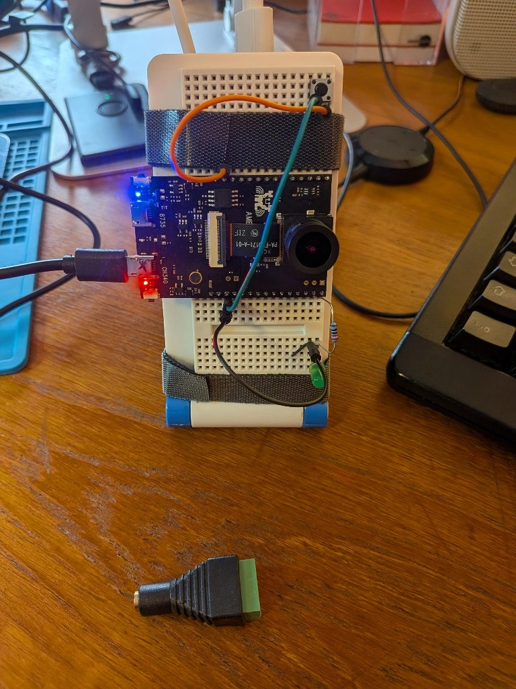

# Video Doorbell System

WebRTC-based video doorbell using AWS Kinesis Video Streams and AWS IoT Core.


*Special thanks to Rui Cardoso for creating this excellent system diagram!*

## System Architecture

```
┌────────────────────────────────────────────────────────────────────┐
│                           AWS Cloud                                │
│                                                                    │
│  ┌──────────────────┐         ┌─────────────────────┐              │
│  │   AWS IoT Core   │         │  Kinesis Video      │              │
│  │                  │         │  Streams (KVS)      │              │
│  │  MQTT Broker     │         │                     │              │
│  │  Topic:          │         │  Signaling Channel  │              │
│  │  doorbell/ring   │         │  doorbell-channel   │              │
│  └────────┬─────────┘         └──────────┬──────────┘              │
│           │                              │                         │
└───────────┼──────────────────────────────┼─────────────────────────┘
            │                              │
            │ MQTT/WSS                     │ WebRTC/WSS
            │ (Ring Events)                │ (Video Stream)
            │                              │
    ┌───────┴────────┐            ┌────────┴─────────┐
    │                │            │                  │
    │                │            │                  │
┌───▼────────────┐   │        ┌───▼──────────────┐   │
│  Master        │   │        │  Viewer(s)       │   │
│  (Raspberry Pi)│   │        │  (Web Browser)   │   │
│                │   │        │                  │   │
│  ┌──────────┐  │   │        │  ┌────────────┐  │   │
│  │ Button   │  │   │        │  │ Video      │  │   │
│  │ Press    │──┼───┘        │  │ Display    │  │   │
│  └──────────┘  │            │  └────────────┘  │   │
│                │            │                  │   │
│  ┌──────────┐  │            │  ┌────────────┐  │   │
│  │ Camera   │  │            │  │ Close Call │  │   │
│  │ (GStreamer)│┼────────────┼─▶│ Open Door  │  │   │
│  └──────────┘  │            │  └────────────┘  │   │
│                │            │                  │   │
│  ┌──────────┐  │            │  Data Channel    │   │
│  │ Door Lock│◀─┼────────────┼──(Commands)      │   │
│  └──────────┘  │            │                  │   │
└────────────────┘            └──────────────────┘   │
                                                     │
                              Multiple viewers supported

Flow:
1. Button press → Master publishes MQTT message
2. Viewer(s) receive MQTT → Show notification
3. Viewer picks up → Establishes WebRTC connection via KVS
4. Master streams video → Viewer displays
5. Viewer clicks "Open Door" → Sends command via data channel
6. Master receives command → Unlocks door
```

## Components

### Master Options

#### Option 1: Linux Master (Raspberry Pi)
- Python script with AWS IoT SDK v2
- C WebRTC application (KVS reference implementation)
- Publishes doorbell events via MQTT
- Streams video via WebRTC
- Receives door unlock commands

#### Option 2: AmebaProII Master (Microcontroller)
- FreeRTOS-based implementation
- Integrated WebRTC on microcontroller
- Lower power consumption
- Real-time operating system
- See [master-amebapro/README.md](master-amebapro/README.md)

##### FreeRTOS Wiring




### Viewer (Web Browser)
- JavaScript web application
- AWS KVS WebRTC JS SDK for video streaming
- AWS IoT Device SDK JS (via git submodule) for MQTT over WebSockets
- Subscribes to MQTT over WebSockets with SigV4 signing
- Receives video via WebRTC
- Sends commands via data channel

**Dependencies:**
- `aws-iot-device-sdk-js` (git submodule) - MQTT functionality
- `aws-sdk-3.758.0-kvswebrtc.js` - AWS SDK for WebRTC
- `kvs-webrtc.min.js` - KVS WebRTC SDK

**Browser Bundle:**
The AWS IoT Device SDK is included as a git submodule and built into a browser bundle (`aws-iot-browser-bundle.js`) using browserify for MQTT functionality.

## Setup

## Setup

### Quick Start

1. **Run automated setup:**
```bash
chmod +x setup-aws-and-config.sh
./setup-aws-and-config.sh
```

This interactive script will:
- Create KVS signaling channel
- Create IoT Thing and certificates
- Generate `.env` and `config.js` files
- Configure all AWS resources

2. **Build KVS WebRTC:**
```bash
cd master/linux-webrtc-reference-for-amazon-kinesis-video-streams
mkdir build && cd build
cmake ..
make
cd ../../..
```

3. **Install Python dependencies (master):**
```bash
cd master
pip3 install -r requirements.txt
cd ..
```

4. **Build browser dependencies (viewer):**
```bash
cd viewer
# Initialize git submodules (AWS IoT Device SDK)
git submodule update --init --recursive

# Build AWS IoT browser bundle (if not already present)
cd aws-iot-device-sdk-js
npm install
cd ..
browserify aws-iot-wrapper.js > aws-iot-browser-bundle.js
cd ..
```

5. **Run master:**
```bash
cd master
source .env
python3 doorbell-master.py
```

6. **Run viewer (in new terminal):**
```bash
cd viewer
python3 -m http.server 8000
```

**⚠️ IMPORTANT:** Always access the viewer via `http://localhost:8000` (NOT `http://0.0.0.0:8000`). The WebRTC signing requires a secure context for Web Crypto APIs, which is only available with `localhost` or HTTPS.

Open http://localhost:8000 and enter your AWS credentials in the configuration form.

## Troubleshooting

### WebRTC "Cannot read properties of undefined (reading 'digest')" Error

This error occurs when the Web Crypto APIs are not available in a secure context:

**Solution:** Always use `http://localhost:8000` instead of `http://0.0.0.0:8000`

**Root Cause:** The KVS WebRTC SDK requires `crypto.subtle` APIs for SigV4 signing, which are only available in secure contexts (HTTPS or localhost). Using `0.0.0.0` doesn't provide this secure context.

**Verification:** Check browser console for:
- `window.crypto: Available`
- `window.crypto.subtle: Available`

### MQTT Connection Issues

Ensure your AWS region matches between:
- IoT endpoint region
- KVS channel region  
- Configuration region setting

### Manual Setup

If you prefer manual setup, see the detailed steps below.

### Manual Setup

If you prefer manual setup, see the detailed steps below.

## Master Setup (Raspberry Pi)

### 1. Install Dependencies
```bash
cd master
pip3 install -r requirements.txt
```

### 2. Configure Environment
```bash
cp .env.example .env
# Edit .env with your AWS IoT endpoint and settings
```

### 3. Setup AWS Certificates
```bash
mkdir -p certs
# Copy your AWS IoT certificates to certs/:
# - certificate.pem.crt
# - private.pem.key
# - AmazonRootCA1.pem
```

### 4. Build KVS WebRTC
```bash
cd linux-webrtc-reference-for-amazon-kinesis-video-streams
mkdir build && cd build
cmake ..
make
cd ../..
```

### 5. Run Master
```bash
source .env
python3 doorbell-master.py
```

Press Enter to simulate doorbell button press.

## Viewer Setup (Web Browser)

### 1. Run Web Server
```bash
cd viewer
python3 -m http.server 8000
```

### 2. Open in Browser and Configure
```
http://localhost:8000
```

Enter your AWS credentials in the configuration form:
- AWS Region (e.g., eu-central-1)
- IoT Endpoint
- KVS Channel ARN
- AWS Access Key ID
- AWS Secret Access Key

Settings are saved in browser localStorage.

## Features

### Master
- Publishes doorbell events via MQTT
- Streams video via WebRTC
- Receives door unlock commands via data channel
- Prints "🔓 DOOR UNLOCKED" when unlock command received

### Viewer
- Receives doorbell ring notifications via MQTT over WebSockets
- Displays live video stream via WebRTC
- **Close Call** button - End video connection
- **Open Door** button - Send unlock command to master
- Supports multiple simultaneous viewers

## Security

- AWS IoT Core with certificate-based authentication (Master)
- SigV4 signed WebSocket connections (Viewer)
- IAM roles with minimal permissions
- No hardcoded credentials in repository
- Never commit `.env` file, certificates, or `config.js` to git
- All secrets are in `.gitignore`
